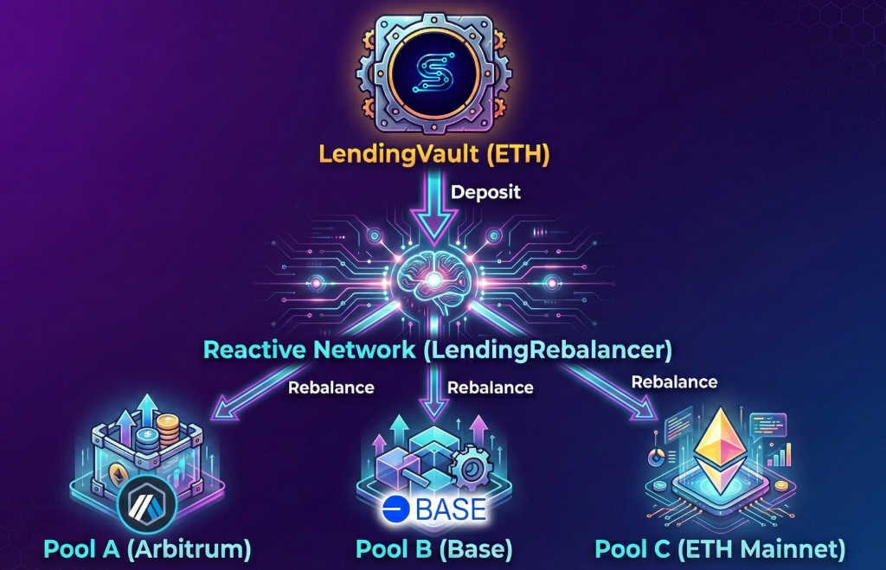

# 🏦 Siaduan Protocol

> Cross-Chain Automated Lending Vault powered by [Reactive Network](https://reactive.network/)

Siaduan is a DeFi protocol that automatically rebalances your funds between lending pools to maximize yield. No manual monitoring required—the protocol detects rate changes and moves your funds to the best opportunities.



---

## 📁 Project Structure

```
Siaduan/
├── Frontend/                          # React web interface
│   ├── src/
│   │   ├── components/
│   │   │   ├── WelcomeHero.jsx       # Landing page (before wallet connect)
│   │   │   ├── HowItWorks.jsx        # Protocol documentation section
│   │   │   ├── VaultCard.jsx         # Deposit/Withdraw interface
│   │   │   ├── ProtocolStatus.jsx    # Live allocation display
│   │   │   ├── RateControl.jsx       # Rate simulation panel
│   │   │   └── FaucetCard.jsx        # Test token minting
│   │   ├── contracts/
│   │   │   └── addresses.js          # Deployed contract addresses
│   │   └── hooks/
│   │       └── useProtocolData.js    # Contract interaction hooks
│   └── public/
│       ├── SiduonIcon.png            # Protocol logo
│       └── protocol-architecture.jpg  # Architecture diagram
│
├── reactive-lending-protocol/         # Smart contracts (Foundry)
│   ├── src/
│   │   ├── destination/              # Contracts on Sepolia
│   │   │   ├── LendingVault.sol      # Main vault - holds user deposits
│   │   │   ├── RateCoordinator.sol   # Aggregates pool rates
│   │   │   └── adapters/
│   │   │       └── MockLendingPool.sol
│   │   ├── reactive/                 # Contracts on Reactive Network
│   │   │   └── LendingRebalancer.sol # Monitors rates & triggers rebalance
│   │   └── mocks/
│   │       └── MockERC20.sol         # Test tokens
│   ├── script/                       # Deployment scripts
│   └── README.md                     # Detailed protocol documentation
│
└── .agent/                           # Agent workflows
```

---

## 🔑 Key Smart Contracts

### Sepolia Testnet

| Contract | File | Purpose |
|----------|------|---------|
| **LendingVault** | [`LendingVault.sol`](./reactive-lending-protocol/src/destination/LendingVault.sol) | Main entry point. Handles deposits, withdrawals, and receives rebalance callbacks |
| **RateCoordinator** | [`RateCoordinator.sol`](./reactive-lending-protocol/src/destination/RateCoordinator.sol) | Aggregates rates from pools and emits `RatesUpdated` events |

### Reactive Network (Lasna)

| Contract | File | Purpose |
|----------|------|---------|
| **LendingRebalancer** | [`LendingRebalancer.sol`](./reactive-lending-protocol/src/reactive/LendingRebalancer.sol) | Subscribes to rate events, detects opportunities, triggers cross-chain callbacks |

---

## ⚙️ Key Functions

### LendingVault.sol
```solidity
deposit(uint256 amount)     // Deposit USDC, receive shares
withdraw(uint256 shares)    // Burn shares, receive USDC
rebalance(...)              // Called by Reactive Network to move funds
getAllocations()            // View current pool allocations
```

### RateCoordinator.sol
```solidity
reportRates(uint256 rateA, uint256 rateB)  // Update rates, emit RatesUpdated event
getRates()                                  // Get current rates
```

### LendingRebalancer.sol
```solidity
react(LogRecord calldata log)      // Called when RatesUpdated detected
subscribeToCoordinator()           // Subscribe to rate events
```

---

## 🌐 Frontend Components

| Component | Purpose |
|-----------|---------|
| `WelcomeHero` | Landing page with protocol overview and Connect Wallet CTA |
| `HowItWorks` | Interactive documentation with architecture diagrams |
| `VaultCard` | Deposit/withdraw interface with balance display |
| `ProtocolStatus` | Shows live allocations between Pool A and Pool B |
| `RateControl` | Sliders to simulate rate changes (testnet) |
| `FaucetCard` | Mint test tokens for testing |

---

## 🔄 How It Works

1. **Deposit** → Users deposit USDC into LendingVault
2. **Monitor** → RateCoordinator emits `RatesUpdated(rateA, rateB)` events
3. **Detect** → LendingRebalancer on Reactive Network detects rate differential >2%
4. **Rebalance** → Cross-chain callback moves funds to higher-yield pool

---

## 📋 Deployed Contracts

### Sepolia (Chain ID: 11155111)
- **LendingVault**: `0xf8Af4B57A22328Af51448A43eEF1bbdE8542852D`
- **RateCoordinator**: `0x8d8159e74eE9c987925a2B5b21Cc6D6970513648`
- **MockUSDC**: `0xf044c58496693C106a7EaE5460d39c1E99ABE074`

### Lasna - Reactive Network (Chain ID: 5318007)
- **LendingRebalancer**: `0x8cC046205284913b2844995fB01281E2945DF76f`

---

## 🚀 Quick Start

```bash
# Frontend
cd Frontend
npm install
npm run dev

# Smart Contracts (requires Foundry)
cd reactive-lending-protocol
forge build
```

---

## � Future Mainnet Integrations

The following adapters are implemented and ready for Mainnet deployment. These contracts allow the protocol to interact with major lending pools once the protocol launches on Ethereum Mainnet.

| Contract | File | Purpose |
|----------|------|---------|
| **AaveV3Adapter** | [`AaveV3Adapter.sol`](./reactive-lending-protocol/src/destination/adapters/AaveV3Adapter.sol) | Adapter for Aave V3 Protocol |
| **CompoundV3Adapter** | [`CompoundV3Adapter.sol`](./reactive-lending-protocol/src/destination/adapters/CompoundV3Adapter.sol) | Adapter for Compound V3 (Comet) Protocol |

> [!NOTE]
> These contracts are currently **NOT deployed**. They are intended for the production release of Siaduan Protocol.

---

## �🔗 Links

- [Reactive Network Docs](https://dev.reactive.network/)
- [Reactscan Explorer](https://lasna.reactscan.net/)
- [LendingRebalancer on Reactscan](https://lasna.reactscan.net/address/0xab6e247b25463f76e81ababbb6b0b86b40d45d38/contract/0x8cc046205284913b2844995fb01281e2945df76f)

---

## 📄 License

MIT
