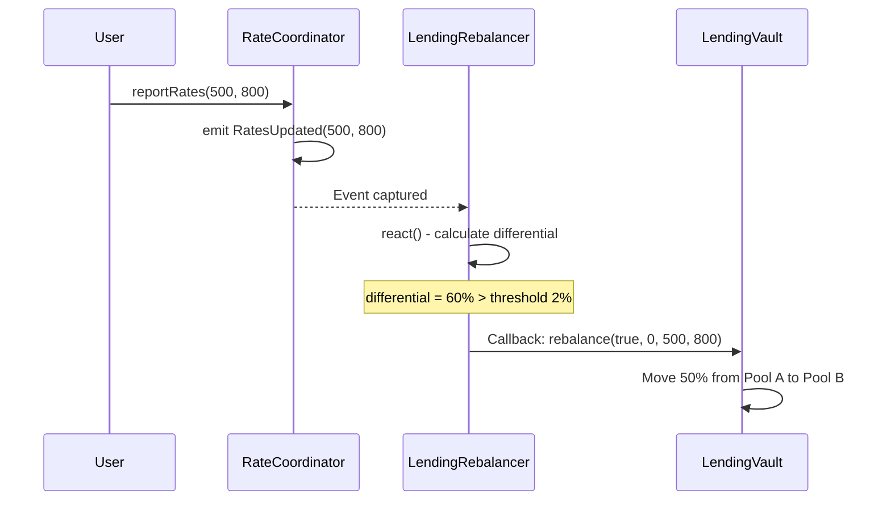
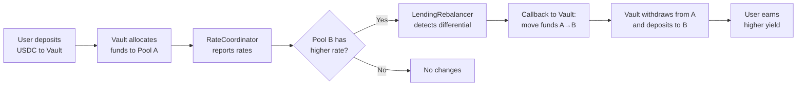

# Siaduan Protocol - Cross-Chain Lending System

## Overview

Siaduan Protocol's lending system is an automated cross-chain lending vault that rebalances funds between two lending pools to optimize user yields. It leverages Reactive Network to monitor interest rates and execute automatic rebalancing.

## Architecture

```mermaid
flowchart TB
    subgraph Sepolia["Sepolia (Origin Chain)"]
        User[User]
        LV[LendingVault]
        RC[RateCoordinator]
        PA[Pool A<br/>MockLendingPool]
        PB[Pool B<br/>MockLendingPool]
    end
    
    subgraph Reactive["Reactive Network"]
        LR[LendingRebalancer]
    end
    
    User -->|Deposit/Withdraw| LV
    LV -->|Deposit/Withdraw| PA
    LV -->|Deposit/Withdraw| PB
    RC -->|RatesUpdated Event| LR
    LR -->|Callback: rebalance()| LV
```

---

## Contracts

### 1. LendingVault

**Location:** [LendingVault.sol](file:///c:/Users/sebas/Siaduan/reactive-oracle-hub/src/destination/LendingVault.sol)

The main vault that manages user deposits and distributes funds across lending pools.

#### Core Functions

| Function | Description |
|----------|-------------|
| `deposit(amount)` | Deposits tokens and receives proportional shares |
| `withdraw(shareAmount)` | Burns shares and receives tokens proportionally |
| `rebalance()` | Reactive Network callback to move funds between pools |
| `getTotalAssets()` | Returns total assets (pools + idle) |
| `getAllocations()` | Returns current distribution in each pool |

#### Main State

```solidity
IERC20 public immutable asset;          // Accepted token (e.g., MockUSDC)
address public immutable callbackProxy; // Reactive Network Proxy
address public authorizedReactVM;       // LendingRebalancer address

PoolInfo public poolA;                  // Pool A configuration
PoolInfo public poolB;                  // Pool B configuration

mapping(address => uint256) public shares;  // Shares per user
uint256 public totalShares;                 // Total shares issued
```

#### Share System

- On deposit: `shares = (amount * totalShares) / totalAssets`
- On withdraw: `amount = (shareAmount * totalAssets) / totalShares`
- Share price: `(totalAssets * 1e18) / totalShares`

---

### 2. RateCoordinator

**Location:** [RateCoordinator.sol](file:///c:/Users/sebas/Siaduan/reactive-oracle-hub/src/destination/RateCoordinator.sol)

Rate aggregator that emits a single event with both rates so the ReactVM can process them.

#### Why Is This Needed?

> [!IMPORTANT]
> ReactVM is **stateless** - each `react()` call starts with clean state.
> RateCoordinator solves this by emitting both rates in a single event.

#### Functions

| Function | Description |
|----------|-------------|
| `reportRateA(rate)` | Reports Pool A rate (basis points) |
| `reportRateB(rate)` | Reports Pool B rate (basis points) |
| `reportRates(rateA, rateB)` | Reports both rates (most efficient) |
| `getRates()` | Gets both current rates |

#### Main Event

```solidity
event RatesUpdated(
    uint256 indexed rateA,
    uint256 indexed rateB,
    uint256 timestamp
);
```

---

### 3. LendingRebalancer

**Location:** [LendingRebalancer.sol](file:///c:/Users/sebas/Siaduan/reactive-oracle-hub/src/reactive/LendingRebalancer.sol)

Reactive contract deployed on Reactive Network (Lasna). Listens to RateCoordinator events and triggers rebalancing.

#### Rebalancing Flow



#### Configuration

| Parameter | Default | Description |
|-----------|---------|-------------|
| `rebalanceThreshold` | 200 (2%) | Minimum differential to trigger rebalance |
| `minRebalanceInterval` | 60s | Minimum interval between rebalances |
| `rebalancePercentage` | 5000 (50%) | Percentage to move from source pool |

#### Decision Logic

```solidity
// Calculate differential
differential = ((higher - lower) * 10000) / lower;

// If differential > threshold
if (differential >= rebalanceThreshold) {
    // direction = true: A -> B (B has higher rate)
    // direction = false: B -> A (A has higher rate)
    bool direction = rateB > rateA;
    _emitRebalanceCallback(direction, 0, rateA, rateB);
}
```

---

### 4. ILendingPoolAdapter

**Location:** [ILendingPoolAdapter.sol](file:///c:/Users/sebas/Siaduan/reactive-oracle-hub/src/interfaces/ILendingPoolAdapter.sol)

Standard interface for lending pool adapters.

```solidity
interface ILendingPoolAdapter {
    function deposit(address asset, uint256 amount) external;
    function withdraw(address asset, uint256 amount) external returns (uint256);
    function getBalance(address asset) external view returns (uint256);
    function getSupplyRate(address asset) external view returns (uint256);
    function poolName() external view returns (string memory);
}
```

---

### 5. MockLendingPool

**Location:** [MockLendingPool.sol](file:///c:/Users/sebas/Siaduan/reactive-oracle-hub/src/destination/adapters/MockLendingPool.sol)

Mock implementation of a lending pool for testing.

#### Features

- Owner-configurable supply rates
- Tracks deposits per user and asset
- Emits events compatible with reactive system

```solidity
// Set interest rate (in basis points)
function setSupplyRate(address asset, uint256 rate) external onlyOwner;

// Also emits PoolRateUpdated for reactive subscriptions
event PoolRateUpdated(uint256 indexed newRate);
```

---

## Complete User Flow



---

## Units and Constants

| Concept | Value | Notes |
|---------|-------|-------|
| Basis Points | 10000 = 100% | 100 bp = 1% |
| Share Price | 1e18 base | Precision scale |
| Callback Gas | 800,000 | Limit for rebalance |
| Default Threshold | 200 bp | 2% differential |

---

## System Events

### LendingVault
- `Deposited(user, amount, shares)`
- `Withdrawn(user, shares, amount)`
- `Rebalanced(direction, amount, rateA, rateB)`

### RateCoordinator
- `RatesUpdated(rateA, rateB, timestamp)` ← Main event for Reactive
- `PoolRateReported(poolId, rate)`

### LendingRebalancer
- `RatesReceived(rateA, rateB, timestamp)`
- `RebalanceTriggered(direction, amount, rateA, rateB)`
- `Callback(destChainId, vault, gasLimit, payload)`

---

## Security

### Modifiers

| Modifier | Contract | Purpose |
|----------|----------|---------|
| `onlyReactive` | LendingVault | Only Callback Proxy can call rebalance |
| `onlyOwner` | All | Admin functions |
| `nonReentrant` | LendingVault | Reentrancy protection |
| `vmOnly` | LendingRebalancer | Only executable in ReactVM |

### Critical Checks

```solidity
// LendingVault - Verify callback origin
modifier onlyReactive() {
    if (msg.sender != callbackProxy) revert Unauthorized();
    _;
}

// LendingVault - Verify authorized ReactVM
require(_sender == authorizedReactVM, "Unauthorized ReactVM");

// LendingRebalancer - Only on Reactive Network
require(!vm, "Cannot call in ReactVM");
```

---

## Deployment Configuration

### Required Variables

```bash
# Sepolia
SEPOLIA_RPC=
SEPOLIA_PRIVATE_KEY=
CALLBACK_PROXY_SEPOLIA=0x33Bbb7D0a2F1029550B0e91f653c4055DC9F4Dd8

# Reactive Network
REACTIVE_RPC=
REACTIVE_PRIVATE_KEY=
```

### Deployment Order

1. **MockUSDC** - ERC20 token for testing
2. **MockLendingPool A** and **B** - Lending pools
3. **RateCoordinator** - With pool addresses
4. **LendingVault** - With asset, callback proxy, and pools
5. **LendingRebalancer** (Reactive) - With chainId, coordinator, and vault
6. Update `authorizedReactVM` in LendingVault
7. Call `subscribeToCoordinator()` on LendingRebalancer
